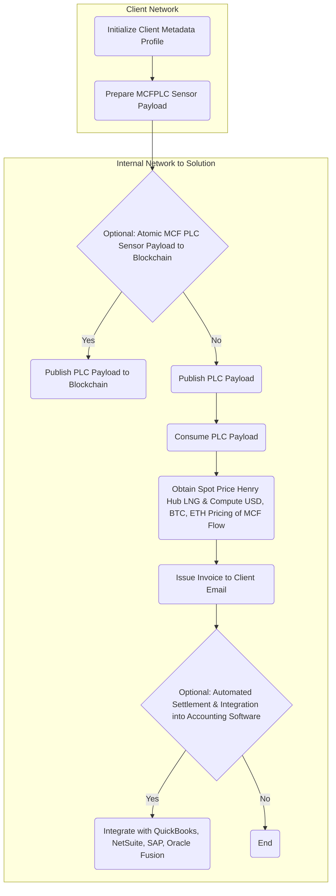
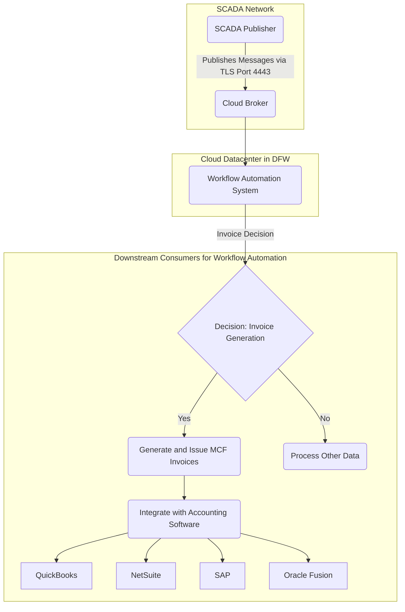

# Workflow Diagram

```mermaid
flowchart TD
    subgraph CN ["Client Network"]
        A(Initialize Client Metadata Profile) --> B(Prepare MCFPLC Sensor Payload)
    end
    subgraph IN ["Internal Network to Solution"]
        B --> C{Optional: Atomic MCF PLC Sensor Payload to Blockchain}
        C -->|Yes| D(Publish PLC Payload to Blockchain)
        C -->|No| E(Publish PLC Payload)
        E --> F(Consume PLC Payload)
        F --> G(Obtain Spot Price Henry Hub LNG & Compute USD, BTC, ETH Pricing of MCF Flow)
        G --> H(Issue Invoice to Client Email)
        H --> I{Optional: Automated Settlement & Integration into Accounting Software}
        I -->|Yes| J(Integrate with QuickBooks, NetSuite, SAP, Oracle Fusion)
        I -->|No| K(End)
    end
```

# Software / Network Diagram

```mermaid
graph TD
    subgraph SCADA_Network ["SCADA Network"]
        A(SCADA Publisher) -->|Publishes Messages via TLS Port 4443| B
    end
    subgraph Cloud_DC ["Cloud Datacenter in DFW"]
        B(Cloud Broker) --> C
    end
    subgraph Downstream_Consumers ["Downstream Consumers for Workflow Automation"]
        C(Workflow Automation System) -->|Invoice Decision| D{Decision: Invoice Generation}
        D -->|Yes| E(Generate and Issue MCF Invoices)
        D -->|No| F(Process Other Data)
        E --> G(Integrate with Accounting Software)
        G --> H[QuickBooks]
        G --> I[NetSuite]
        G --> J[SAP]
        G --> K[Oracle Fusion]
    end
```